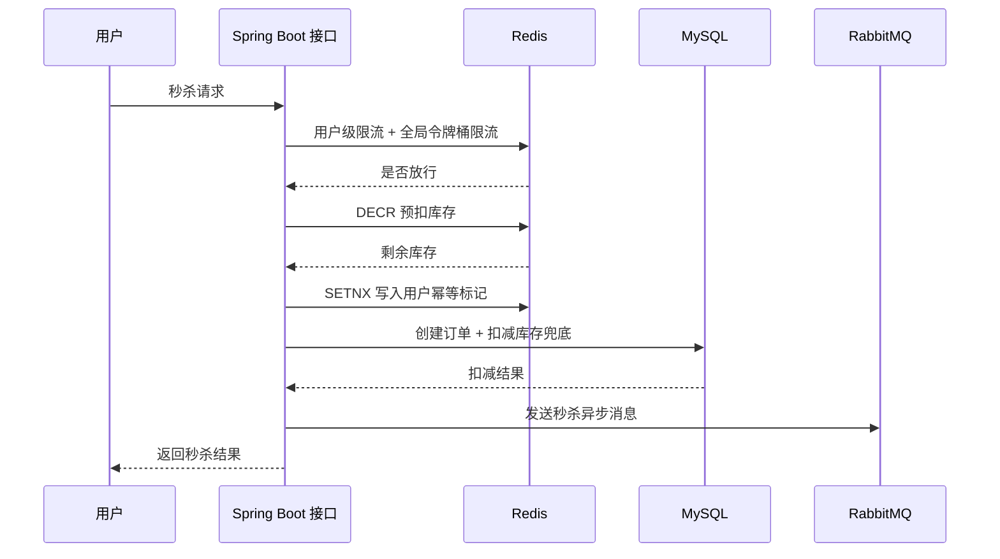
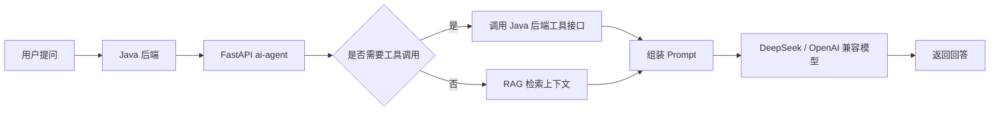

# WordFlash 单词学习助手

面向微信小程序的单词学习后端项目，围绕用户学习、积分商城、限时秒杀和 AI 学习助手构建。项目定位不是简单 CRUD，而是一个用于练习真实后端工程能力的综合型项目，重点覆盖缓存、消息队列、限流、幂等、事务一致性、接口观测和大模型应用接入。

> 求职定位：Java 后端开发实习生 / AI 应用后端实习生

## 项目亮点

- 基于 Spring Boot 3.2 + Java 17 + MyBatis 构建后端服务，按 Controller / Service / Mapper 分层开发。
- 使用 MySQL 存储用户、单词书、积分、订单、秒杀活动等核心业务数据。
- 使用 Redis 承载登录 Token、积分缓存、秒杀库存、用户幂等标记和接口限流。
- 使用 RabbitMQ 处理登录缓存、购买后置操作、秒杀订单等异步任务，降低主链路响应压力。
- 秒杀链路覆盖库存预热、Redis 预扣减、SETNX 防重复提交、Lua 限流、MySQL 扣库存兜底和 MQ 异步处理。
- 提供独立 FastAPI `ai-agent` 服务骨架，用于接入 DeepSeek / OpenAI 兼容模型，演示 RAG、Function Calling 和后端工具调用思路。
- 补充 Docker Compose、接口说明和设计文档，方便本地运行、面试讲解和后续部署。

## 技术栈

| 方向 | 技术 |
| --- | --- |
| 后端框架 | Java 17, Spring Boot 3.2, Spring MVC, MyBatis |
| 数据存储 | MySQL, Redis |
| 消息队列 | RabbitMQ |
| 工程能力 | Maven, Docker, Docker Compose, Git |
| AI 应用 | Python, FastAPI, OpenAI-compatible API, RAG, Function Calling |
| 测试压测 | k6 / JMeter / Apifox / Postman |

## 核心模块

### 1. 用户体系

- 用户注册、登录、退出登录、Token 校验。
- BCrypt 加密存储用户密码。
- 登录成功后将 Token 和用户信息写入 Redis，并设置过期时间。
- 登录后通过 MQ 发送用户登录消息，异步预热用户相关缓存。

### 2. 积分商城

- 单词书列表分页查询。
- 商品详情查询。
- 积分余额查询。
- 签到积分。
- 普通购买单词书。
- 购买后通过 MQ 异步处理非关键路径，例如单词复制、统计更新等。

### 3. 限时秒杀

秒杀链路是本项目的主要后端亮点。



关键设计：

- Redis 预热秒杀活动库存，减少数据库热点压力。
- Redis `DECR` 进行库存预扣减，快速拦截无库存请求。
- Redis `SETNX` 做用户幂等标记，限制同一用户重复下单。
- Redis Lua 脚本实现用户级固定窗口限流和全局令牌桶限流。
- MySQL 扣库存作为兜底校验，扣减失败时回滚 Redis 库存和幂等标记。
- MQ 异步处理后置逻辑，主链路只保留核心校验和订单创建。

### 4. AI 学习助手

`ai-agent` 是独立的 FastAPI 服务，目标是让 Java 后端具备大模型应用接入能力。



当前定位：

- 演示大模型服务和 Java 后端解耦。
- 支持 Prompt 组织、简单 RAG 检索和工具调用框架。
- 可将签到、积分查询、单词本查询、单词管理等后端接口抽象为工具。
- 支持模型不可用时的降级返回，避免影响主业务流程。

## 仓库结构

```text
resumeproject/
├── backend/                  # Spring Boot 后端服务
├── ai-agent/                 # FastAPI 大模型应用服务
├── docs/                     # 架构与面试说明文档
├── docker-compose.yml        # 本地基础设施编排
└── README.md
```

## 本地启动

### 1. 启动基础设施

```bash
docker compose up -d mysql redis rabbitmq
```

服务端口：

| 服务 | 地址 |
| --- | --- |
| MySQL | localhost:3306 |
| Redis | localhost:6379 |
| RabbitMQ | localhost:5672 |
| RabbitMQ Management | http://localhost:15672 |

RabbitMQ 默认账号密码：

```text
wordflash / wordflash
```

### 2. 启动后端服务

```bash
cd backend
mvn spring-boot:run
```

### 3. 启动 AI Agent 服务

```bash
cd ai-agent
python -m venv .venv
.venv\Scripts\activate  # Windows
pip install -r requirements.txt
uvicorn main:app --host 0.0.0.0 --port 8001 --reload
```

如需调用真实模型，请配置环境变量：

```bash
DEEPSEEK_API_KEY=你的 key
DEEPSEEK_BASE_URL=https://api.deepseek.com
BACKEND_BASE_URL=http://localhost:8080
```

## 典型接口

### 用户登录

```http
POST /api/user/login
Content-Type: application/json

{
  "username": "test",
  "password": "123456"
}
```

### 查询商城单词书

```http
GET /api/store/books?page=1&size=10
Authorization: Bearer <token>
```

### 秒杀购买

```http
POST /api/store/flash-sale/purchase/{activityId}
Authorization: Bearer <token>
```

### AI 对话

```http
POST http://localhost:8001/chat
Content-Type: application/json

{
  "user_id": 1,
  "message": "帮我查看积分，并推荐今天要复习的单词"
}
```

## 压测建议

建议使用 k6 对秒杀接口进行压测，并将结果截图放到 `docs/performance/`。

示例目标：

| 并发用户 | 目标 |
| --- | --- |
| 100 | 接口稳定，无明显错误 |
| 300 | 限流生效，错误可控 |
| 500 | 无超卖，无重复下单 |

建议记录：

- QPS
- 平均响应时间
- P95 响应时间
- 失败率
- 库存是否超卖
- 重复下单是否被拦截

## 面试可讲点

1. 为什么登录 Token 放 Redis？
2. Redis 预扣库存和 MySQL 兜底扣库存分别解决什么问题？
3. SETNX 如何保证用户幂等？失败后为什么要回滚？
4. RabbitMQ 放在购买链路中解决了什么问题？
5. 用户级限流和全局限流有什么区别？为什么使用 Lua？
6. AI Agent 为什么独立成 FastAPI 服务，而不是直接写在 Java 里？
7. Function Calling 如何把后端接口变成大模型工具？
8. 模型不可用时如何降级，避免影响主业务？

## 后续升级计划

- [ ] 补充 Swagger / Knife4j 接口文档。
- [ ] 完善 MQ 消费幂等和失败补偿任务。
- [ ] 增加 k6 压测脚本和压测报告。
- [ ] AI Agent 接入真实词库检索和用户学习记录。
- [ ] 增加 Dockerfile，实现后端服务一键部署。
- [ ] 部署到服务器，提供在线演示地址。
