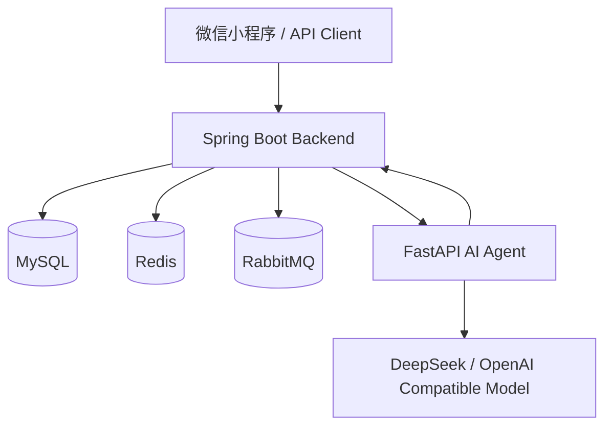
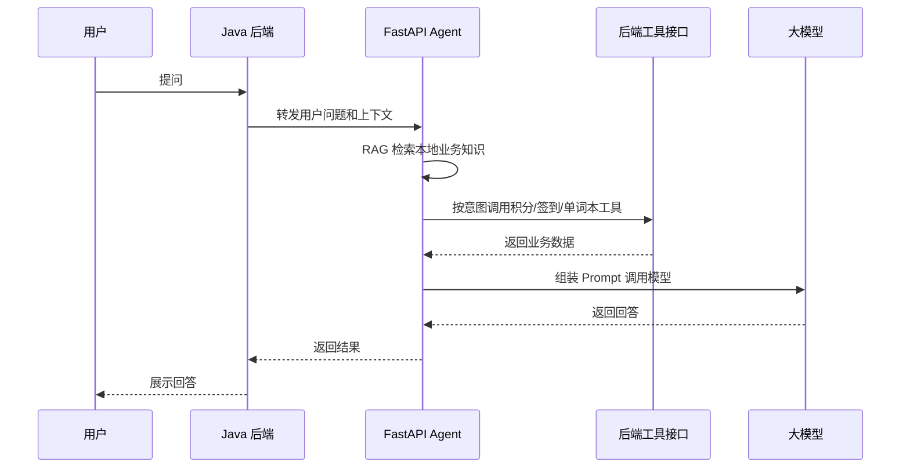

# WordFlash 系统设计说明

本文档用于说明 WordFlash 后端与 AI Agent 的整体设计，重点服务于项目复盘、面试讲解和后续工程升级。

## 1. 整体架构



设计原则：

- Java 后端负责核心业务闭环，例如用户、积分、商城、订单、秒杀。
- Redis 承担缓存、库存、限流、幂等等高频读写能力。
- RabbitMQ 承担异步解耦和削峰，减少主链路耗时。
- AI Agent 独立部署，避免模型调用影响主业务稳定性。

## 2. 后端分层

```text
Controller: 接口入参、用户上下文、结果包装
Service: 业务编排、事务控制、缓存和 MQ 调用
Mapper: MyBatis 数据访问
Entity/DTO/VO: 数据模型与接口模型
Config: Redis、RabbitMQ、拦截器、AOP 等配置
```

分层收益：

- Controller 保持轻量，便于接口维护。
- Service 聚合业务逻辑，便于事务边界控制。
- Mapper 只关注 SQL，便于后续索引优化和慢查询定位。

## 3. 登录与缓存设计

登录流程：

1. 用户提交账号密码。
2. 后端查询用户并用 BCrypt 校验密码。
3. 生成 Token。
4. 将 Token -> 用户信息写入 Redis，并设置过期时间。
5. 加载积分账户，将积分余额写入 Redis。
6. 发送用户登录 MQ 消息，异步预热用户相关数据。

关键点：

- Redis 降低后续请求对 MySQL 的频繁查询。
- Token 设置过期时间，便于控制登录态生命周期。
- 登录后异步缓存非关键数据，减少登录接口主链路耗时。

## 4. 购买链路设计

普通购买流程：

1. 校验用户是否重复购买。
2. 查询商品信息。
3. 校验积分余额。
4. 扣减积分。
5. 创建用户单词书。
6. 写入购买记录。
7. 发送 MQ 消息处理单词复制、统计更新等非关键路径。

设计取舍：

- 关键路径同步完成，保证用户立即获得购买结果。
- 非关键路径异步处理，降低接口响应时间。
- 购买记录落库，便于审计和问题追踪。

## 5. 秒杀链路设计

秒杀场景主要关注三类问题：

- 高并发请求瞬时打入后端。
- 库存不能超卖。
- 同一用户不能重复下单。

处理流程：

1. 系统启动时预热秒杀库存到 Redis。
2. 请求进入后先做用户级限流和全局限流。
3. Redis `DECR` 预扣库存，库存不足立即拦截。
4. Redis `SETNX` 写入用户幂等标记，防止重复提交。
5. MySQL 扣减库存兜底，防止 Redis 与 DB 不一致导致超卖。
6. MySQL 扣减失败时回滚 Redis 库存和用户幂等标记。
7. 写入订单记录并发送 MQ 消息。

## 6. 限流设计

### 用户级限流

用于限制单个用户对同一活动的请求频率，避免恶意刷接口。

- 算法：固定窗口。
- 存储：Redis。
- 原子性：Lua 脚本。

### 全局限流

用于限制整个秒杀接口的总流量，保护后端和数据库。

- 算法：令牌桶。
- 桶容量：支持短时间突发。
- 填充速率：控制稳定吞吐。
- 原子性：Lua 脚本。

## 7. MQ 设计

RabbitMQ 用于处理非核心链路：

- 用户登录后的缓存预热。
- 普通购买后的单词复制和统计更新。
- 秒杀后的异步处理。
- 积分变动落库。

建议后续升级：

- 消费端增加幂等表。
- 消费失败进入死信队列。
- 定时任务扫描长时间未完成消息，做补偿处理。

## 8. AI Agent 设计

AI Agent 独立于 Java 后端，避免模型调用影响核心业务。



关键点：

- RAG：把用户单词本、公共词库、学习记录等信息作为上下文。
- Function Calling：将后端业务接口抽象为工具。
- 降级：模型不可用时返回规则化结果。
- 日志：记录 userId、prompt、tool、latency、status，方便排查。

## 9. 中厂面试可讲升级点

### 后端方向

- 登录态为什么放 Redis？
- Redis 缓存和 MySQL 数据一致性如何考虑？
- 秒杀为什么需要 Redis 预扣库存？
- MySQL 兜底扣库存解决什么问题？
- MQ 如何削峰？消息失败怎么办？
- Lua 为什么能保证限流原子性？

### 大模型应用方向

- AI Agent 为什么独立为 FastAPI 服务？
- RAG 检索的数据源怎么选？
- Function Calling 如何映射后端接口？
- 模型超时或失败时如何降级？
- 如何记录大模型调用链路，方便排查？

## 10. 后续建议

优先级从高到低：

1. Swagger / Knife4j 接口文档。
2. k6 秒杀压测脚本和报告。
3. MQ 消费幂等与补偿任务。
4. AI Agent 接入真实单词本和学习记录。
5. 服务部署到云服务器，提供演示地址。
